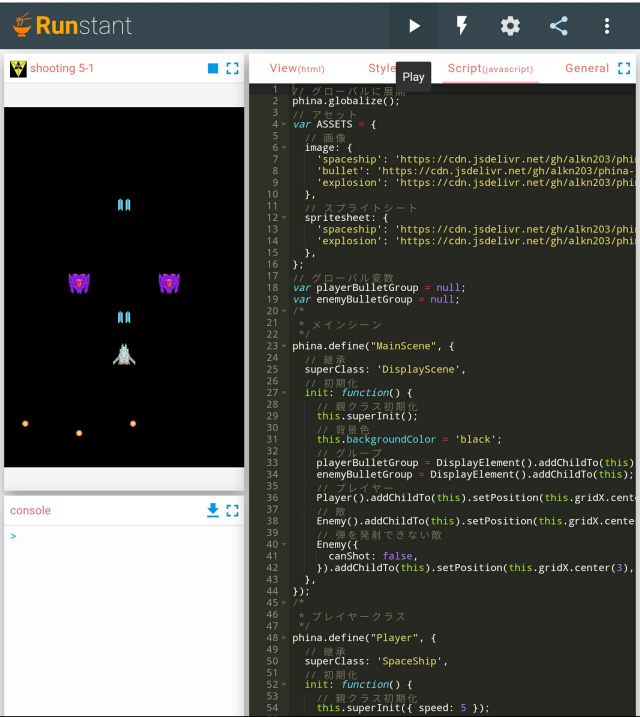

### プログラミングの準備
**phina.js**の公式オンラインエディタの位置付けである[Runstant]()を主に使います。



以下のディレクトリのファイル一式をダウンロードすれば、ローカルでも実行可能です。

### ひな形
私が普段使っている以下の[ひな形](http://runstant.com/alkn203/projects/8f0388a4)から作成していきます。

```javascript
// グローバルに展開
phina.globalize();
/*
 * メインシーン
 */
phina.define("MainScene", {
  // 継承
  superClass: 'DisplayScene',
  // 初期化
  init: function() {
    // 親クラス初期化
    this.superInit();
    // 背景色
    this.backgroundColor = 'black';
    // 以下にコードを書いていく
  },
  // 毎フレーム更新処理
  update: function() {
    // 以下にコードを書いていく  
  },
});
/*
 * メイン処理
 */
phina.main(function() {
  // アプリケーションを生成
  var app = GameApp({
    // MainScene から開始
    startLabel: 'main',
  });
  // fps表示
  //app.enableStats();
  // 実行
  app.run();
});
```
