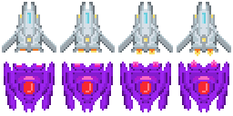

## はじめに
[前回](00-introduction.html)は、**phina.js**におけるコーディングの準備までを書きました。今回から具体的にチュートリアルを進めていきます。

## テクスチャからスプライトを作成する
**Unity**では内臓のスプライトエディタで作成しますが、**phina.js**ではアセットとして別に用意した画像ファイルを読み込みます。

## 用意した画像
プレイヤーと敵    


プレイヤーと敵の弾     


爆発    


- これらの画像は、一般的に**スプライトシート**と呼ばれており同じサイズの画像を複数枚タイル状に並べたものです。
- 一枚当たりのサイズを指定して切り出すことで、好きなコマ画像を表示したり、**フレームアニメーション**と言われるコマ送りの動画を表現することができます。

### 自機と敵のアニメーション
以下ようなアニメーションを作成します。


### フレームアニメーション定義ファイルの作成
- フレームアニメーションは、少ないコマ数であればコード中でフレームインデックスを指定して表現することもできますが、アニメーションの種類が増えると複雑になりがちです
- **phina.js**ではフレームアニメーション定義ファイルを作成してアセットとして読み込むことで、簡単にアニメーションを行うことができます。

### 自機と敵の定義ファイル

```javascript
{
  "frame": {
    "width": 64,
    "height": 64,
    "cols": 4,
    "rows": 4
  },
  "animations" : {
    "player": {
      "frames": [0,1,2,3,2,1],
      "next": "player",
      "frequency": 1
    },
    "enemy": {
      "frames": [4,5,6,7,6,5],
      "next": "enemy",
      "frequency": 1
    }
  }
}
```

定義ファイルは**json**形式で作成します。

* **frame**の**width**と**heightは**、１コマ毎に画像を切り出すサイズで、今回は**64x64**としています。
* **cols**は横、**row**は縦の画像のコマ数で、**4x4**の合計16コマであることが分かります。
* **animations**で個別のアニメーションを定義します。
* **player**はアニメーション名で、任意の名前を設定することができます。
* **frames**で何番目のコマを使うかを配列形式で指定します。自機の画像は4コマ目までなので、今回は**0→1→2→3→2→1**と順番に切り替えてアニメーションさせます。敵の画像は5から8コマ目なので、同様に指定しています。配列なのでインデックスは0から始まります。
* **next**で次のアニメーションを指定します。同じアニメーション名を指定すると、ループします。
* **frequency**はアニメーションの間隔で、小さければ速くなり、大きければ遅くなります。

### 爆発アニメーションの定義ファイル
以下のようなアニメーションを作成します。


```javascript
{
  "frame": {
    "width": 64,
    "height": 64,
    "cols": 10,
    "rows": 1
  },
  "animations" : {
    "explosion": {
      "frames": [0,1,2,3,4,5,6,7,8,9],
      "frequency": 1
    }
  }
}
```

自機と敵の場合と違う点は、**animations**の**next**を指定していないところです。理由は、爆発アニメーションは1回限りで良いからです。

### 弾の作成
自機と敵の弾は特にアニメーションをしないので、画像をアセットとして読み込み、プログラム内からフレームインデックスを指定する方法をとります。

### 画像とアニメーション定義ファイルをアセットとして読み込む
アセットをプログラムで使用するためには、ソース内で以下のように記述します。

### アセットの宣言

```javascript
// アセット
var ASSETS = {
  // 画像
  image: {
    'spaceship': 'https://cdn.jsdelivr.net/gh/alkn203/phina-js-tutorials@master/shooting/assets/ships.png',
    'bullet': 'https://cdn.jsdelivr.net/gh/alkn203/phina-js-tutorials@master/shooting/assets/shot.png',
    'explosion': 'https://cdn.jsdelivr.net/gh/alkn203/phina-js-tutorials@master/shooting/assets/explosion.png',
  },
  // スプライトシート
  spritesheet: {
    'spaceship': 'https://cdn.jsdelivr.net/gh/alkn203/phina-js-tutorials@master/shooting/assets/ships.ss',
    'explosion': 'https://cdn.jsdelivr.net/gh/alkn203/phina-js-tutorials@master/shooting/assets/explosion.ss',
  },
};
```

* 画像ファイルは、**image**の以下に連想配列形式で並べていきます。
* フレームアニメーション定義ファイルは、**spritesheet**以下に同じよう並べていきます。
* サイトにアップされた素材を指定していますが、ローカルのファイルを指定することも可能です。

### main関数でアセットを指定

```javascript
/*
 * メイン処理
 */
phina.main(function() {
  // アプリケーションを生成
  var app = GameApp({
    // アセット指定
    assets: ASSETS,
    // メインシーンから開始
    startLabel: 'main',
  });
  // 実行
  app.run();
});
```

**GameApp**関数のパラメーターとして、先に定義したアセットを指定します。

### スプライトの表示とフレームアニメーションの実行
アセットとして読み込んだ後は、コード内で以下のように使用します。

```javascript
// プレイヤー
var player = Sprite('spaceship', 64, 64).addChildTo(this);
player.setPosition(this.gridX.center(), this.gridY.center(3));
FrameAnimation('spaceship').attachTo(player).gotoAndPlay('player');
```

### 実行サンプル
[https://runstant.com/alkn203/projects/2078b429:embed:cite]
