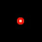

### はじめに
[前回](05-enemy.md)は、敵を追加して敵が弾を発射するようにしました。今回は、当たり判定を作成します。

### Colliderクラスを作成する
**Unity**では、コライダーという当たり判定を行うためのコンポーネントが用意されていますが、**phina.js**にはありません。そこで、それに似た機能を持たせた**Collider**というクラスを作りました。

```javascript
/*
 * コライダークラス
 */
phina.define("Collider", {
  // 継承
  superClass: 'RectangleShape',
  // 初期化
  init: function(param) {
    // 親クラス初期化
    this.superInit({
      width: param.width,
      height: param.height,
      fill: null,
      stroke: 'red',
    });
  },
  // コライダーの絶対座標の矩形
  getAbsoluteRect: function() {
    var x = this.left + this.parent.x;
    var y = this.top + this.parent.y;
    return Rect(x, y, this.width, this.height);
  },
});
```

- 今回は簡易な矩形での当たり判定を行うので、**RentangleShape**クラスを継承しています。
- コライダーは子要素として追加するため、コライダー自体の座標は相対座標値になることから、親の座標を元に絶対座標値の矩形を計算して返す関数を用意します。

### 仕様変更
これまでプレイヤーと敵の弾は、空のクラスに一旦追加する形にしていましたが、当たり判定における親子関係を出来るだけシンプルにするために、**shot**関数の中で直接生成する形に変更しました。

### 当たり判定を付ける
#### プレイヤー
プレイヤークラスでコライダーを以下のように追加します。

```javascript
/*
 * プレイヤークラス
 */
phina.define("Player", {
  // 継承
  superClass: 'SpaceShip',
  // 初期化
  init: function() {
    // 親クラス初期化
    this.superInit({ speed: 5 });
    // フレームアニメーション指定
    this.anim.gotoAndPlay('player');
    // 当たり判定用矩形
    this.collider = Collider({
      width: 20,
      height: 20,
    }).addChildTo(this);
```

プレイヤーの当たり判定    


#### 敵
敵クラスでコライダーを以下のように追加します。

```javascript
/*
 * 敵クラス
 */
phina.define("Enemy", {
  // 継承
  superClass: 'SpaceShip',
  // 初期化
  init: function(param) {
    // 親クラス初期化
    this.superInit({ speed: 0.5 });
    // フレームアニメーション指定
    this.anim.gotoAndPlay('enemy');
    // 当たり判定用矩形
    this.collider = Collider({
      width: 40,
      height: 40,
    }).addChildTo(this);
```

敵の当たり判定    


#### プレイヤーの弾
プレイヤーの弾クラスでコライダーを以下のように追加します。

```javascript
/*
 * プレイヤーの弾クラス
 */
phina.define("PlayerBullet", {
  // 継
  superClass: 'Sprite',
  // 初期化
  init: function() {
    // 親クラス初期化
    this.superInit('bullet', 64, 64);
    // スピード
    var speed = 10;
    // 当たり判定用のコライダー
    this.collider = Collider({
      width: 10,
      height: 30,
    }).addChildTo(this);
```

プレイヤーの弾の当たり判定    


#### 敵の弾
敵の弾クラスでコライダーを以下のように追加します。

```javascript
/*
 * 敵の弾クラス
 */
phina.define("EnemyBullet", {
  // 継承
  superClass: 'Sprite',
  // 初期化
  init: function() {
    // 親クラス初期化
    this.superInit('bullet', 64, 64);
    this.setFrameIndex(1);
    // スピード
    this.speed = 10;
    // 当たり判定用のコライダー
    this.collider = Collider({
      width: 10,
      height: 10,
    }).addChildTo(this);
```

敵の弾の当たり判定    


### 当たり判定
各種当たり判定は、シーンの**Update**関数内で行います。**Unity**では、**OnCollisionEnter**のようにイベント駆動型の当たり判定処理になっていますが、**phina.js**は現時点でこのような仕様にはなっていません。

#### プレイヤーと敵の弾の当たり判定
- プレイヤーと敵の弾の当たり判定用に**hitTestBulletToPlayer**という関数を用意して、**Update**から呼び出します。
- オブジェクトをグループ毎に管理することで、当たり判定処理を切り分けて行うことができます。このグループに、**Unity**のレイヤーの役割をさせます。

```javascript
  // 毎フレーム処理
  update: function() {
    // 当たり判定
    this.hitTestBulletToPlayer();
    this.hitTestEnemyToP
  },
  // 敵の弾とプレイヤーの当たり判定
  hitTestBulletToPlayer: function() {
    var self = this;

    enemyBulletGroup.children.each(function(bullet) {
      self.playerGroup.children.each(function(player) {
      // 当たり判定用の矩形
      var r1 = bullet.collider.getAbsoluteRect();
      var r2 = player.collider.getAbsoluteRect();
      // ヒットなら
      if (Collision.testRectRect(r1, r2)) {
        // 弾削除
        bullet.remove();
        // 爆発表示
        Explosion().addChildTo(self).setPosition(player.x, player.y);
        // プレイヤー削除
        player.remove();
      }
      });
    });
  },
```

- 当たり判定はコライダー同士でおこないます。
- コライダーの**getAbsoluteRect**関数で絶対座標値の矩形が返ってきますので、**Collision.testRectRect**メソッドで矩形の当たり判定を行います。
- ヒットしたらプレイヤーの位置に爆発を表示して、プレイヤーを削除しています。
- プレイヤーをシーンに直接ではなく、グループに追加するように変更してますが、これは削除処理を確実に行うためです。

#### 爆発アニメーションクラス
爆発アニメーションのクラスは以下のようになっています。

```javascript
/*
 * 爆発クラス
 */
phina.define("Explosion", {
  // 継承
  superClass: 'Sprite',
  // 初期化
  init: function(param) {
    // 親クラス初期化
    this.superInit('explosion', 64, 64);
    // フレームアニメーションをアタッチ
    FrameAnimation('explosion').attachTo(this).gotoAndPlay('explosion');
  },
});
```

###  ここまでのサンプル
[実行サンプル(runstant)](https://runstant.com/alkn203/projects/8b70e935)

#### 爆発アニメーション終了後にオブジェクトを削除する
上のサンプルでは、爆発アニメーション後にそのまま最後のコマが残ってしまっています。
これを解決するために、フレームアニメーションの終了を検知して、自身を消去する処理をクラスの**Update**に追加します。

```javascript
  // 更新処理
  update: function() {
    // フレームアニメーションが終了したら自身を削除
    if (this.anim.finished) {
      this.remove();
    }
  }
```

#### 敵と弾が画面外に出たら削除する
現状だと、敵と敵やプレイヤーの弾は画面外に出てもそのまま存在し続けます。放っておくと処理に負荷がかかる可能性があるので、画面外に出たら削除するようにします。
今回は、座標関係情報だけを持った画面の矩形を作って判定する方法にします。

```javascript
// 定数
var SCREEN_RECT = Rect(0, 0, 640, 960); // 画面の矩形
```

画面外の判定処理は、それぞれのクラスの**Update**に追加します。以下は、敵の例です。

```javascript
  // 毎フレーム更新処理
  update: function() {
    // 機体の移動
    this.move(Vector2.DOWN);
    // 画面下に出たら削除
    if (this.top > SCREEN_RECT.bottom) {
      this.remove();
    }
  },
```

上のように、数値でなくプロパティで判定できるので便利です。

#### プレイヤーと敵の当たり判定
プレイヤーと敵の弾の場合と同じように関数を用意して、判定を行います。

```javascript
  // 敵とプレイヤーの当たり判定
  hitTestEnemyToPlayer: function() {
    var self = this;

    this.enemyGroup.children.each(function(enemy) {
      self.playerGroup.children.each(function(player) {
        // 当たり判定用の矩形
        var r1 = enemy.collider.getAbsoluteRect();
        var r2 = player.collider.getAbsoluteRect();
        // ヒットなら
        if (Collision.testRectRect(r1, r2)) {
          // 爆発表示
          Explosion().addChildTo(self).setPosition(player.x, player.y);
          // プレイヤー削除
          player.remove();
        }
      });
    });
  },
```

#### プレイヤーの弾と敵の当たり判定

```javascript
  // プレイヤーの弾と敵の当たり判定
  hitTestBulletToEnemy: function() {
    var self = this;

    playerBulletGroup.children.each(function(bullet) {
      self.enemyGroup.children.each(function(enemy) {
        // 当たり判定用の矩形
        var r1 = bullet.collider.getAbsoluteRect();
        var r2 = enemy.collider.getAbsoluteRect();
        // ヒットなら
        if (Collision.testRectRect(r1, r2)) {
          // 弾削除
          bullet.remove();
          // 爆発表示
          Explosion().addChildTo(self).setPosition(enemy.x, enemy.y);
          // 敵削除
          enemy.remove();
        }
      });
    });
  }, 
```

### ここまでのサンプル
[実行サンプル](https://runstant.com/alkn203/projects/3387cbcd)

### コライダーを非表示にする
当たり判定は確認できたので、最後にコライダーを非表示にします。**phina.js**のオブジェクトは、**hide**メソッドで非表示にすることができますので、**Collider**クラスのコンストラクで以下のように追加します

```javascript
/*
 * コライダークラス
 */
phina.define("Collider", {
  // 継承
  superClass: 'RectangleShape',
  // 初期化
  init: function(param) {
    // 親クラス初期化
    this.superInit({
      width: param.width,
      height: param.height,
      fill: null,
      stroke: 'red',
    });
    // 非表示
    this.hide();
  },
```

### サンプル

[実行サンプル](https://runstant.com/alkn203/projects/14f69fd8)
